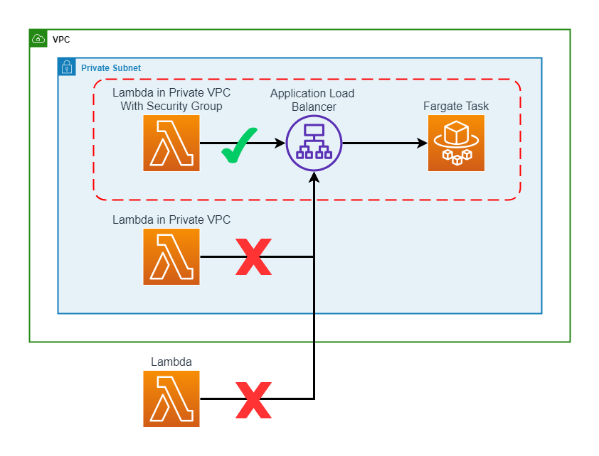

# Building a Private Fargate Task and Lambda

In order to build an AWS Fargate task in a [private subnet](https://docs.aws.amazon.com/vpc/latest/userguide/configure-subnets.html) that can still be invoked by a Lambda function, the Lambda function must also be built in the same VPC with access to the private subnet.



## Building the VPC and ALB

```typescript
this.vpc = new Vpc(this, 'VPC', {
  subnetConfiguration: [
    {
      cidrMask: 24,
      name: 'PrivateSubnet',
      subnetType: SubnetType.PRIVATE_WITH_EGRESS,
    },
    {
      cidrMask: 24,
      name: 'PublicSubnet',
      subnetType: SubnetType.PUBLIC,
    },
  ],
  maxAzs: 2,
});
```

Here we are creating a VPC with two types of Subnets - `PRIVATE_WITH_EGRESS` and `PUBLIC`.

```typescript
this.applicationLoadBalancer = new ApplicationLoadBalancer(this, 'alb', {
  vpc: this.vpc,
  vpcSubnets: { subnetType: SubnetType.PRIVATE_WITH_EGRESS },
  internetFacing: false,
  securityGroup: this.fargateSecurityGroup,
});
```

Next we will create an Application Load Balancer in the `PRIVATE_WITH_EGRESS` subnet.

## Fargate

```typescript
this.fargateService = new ApplicationLoadBalancedFargateService(
  this,
  'fargateService',
  {
    taskImageOptions: {
      image: ContainerImage.fromRegistry('amazon/amazon-ecs-sample'),
      taskRole: fargateTaskRole,
    },
    publicLoadBalancer: false,
    vpc: props.vpc,
    assignPublicIp: false,
    openListener: false,
    loadBalancer: props.applicationLoadBalancer,
    listenerPort: 80,
    taskSubnets: {
      subnetType: SubnetType.PRIVATE_WITH_EGRESS,
    },
    securityGroups: [props.fargateSecurityGroup],
    runtimePlatform: {
      operatingSystemFamily: OperatingSystemFamily.LINUX,
      cpuArchitecture: CpuArchitecture.X86_64,
    },
  },
);
```

Next we will create the Fargate Service and Task, once again assigning it to the `PRIVATE_WITH_EGRESS` subnet using the previously created Application Load Balancer.

## Lambda

```typescript
const fargateLambdaInPrivateVPCwithSG = new NodejsFunction(
  this,
  'fargateLambdaInPrivateVPCwithSG',
  {
    entry: 'src/resources/fargateLambda/index.ts',
    runtime: Runtime.NODEJS_LATEST,
    architecture: Architecture.ARM_64,
    role: lambdaRole,
    timeout: Duration.seconds(60),
    vpc: props.vpc,
    vpcSubnets: { subnetType: SubnetType.PRIVATE_WITH_EGRESS },
    securityGroups: [lambdaSecurityGroup],
    environment: {
      FARGATE_ALB_URL: props.fargateService.loadBalancer.loadBalancerDnsName,
    },
  },
);
```

Finally, we will create the Lambda function and assign to the `PRIVATE_WITH_EGRESS` subnet.

## Security Groups

In addition to containing the Lambda, Application Load Balancer, and Fargate within the same VPC and private subnet, Security Groups can also be used to restrict access.

```typescript
this.fargateSecurityGroup = new SecurityGroup(this, 'fargateSecurityGroup', {
  vpc: this.vpc,
  description: 'Security Group for Fargate ALB',
});
```

First we will create a Security Group for the Application Load Balancer.

```typescript
const lambdaSecurityGroup = new SecurityGroup(this, 'LambdaSecurityGroup', {
  vpc: props.vpc,
});
```

Next we will create a Security Group for the Lambda function.

```typescript
props.fargateSecurityGroup.connections.allowFrom(
  new Connections({
    securityGroups: [lambdaSecurityGroup],
  }),
  Port.tcp(80),
  'allow traffic on port 80 from the Lambda security group',
);
```

Finally, we will allow a connection from the Lambda Security Group to the Application Load Balancer Security Group. This will allow the Lambda function to make requests to the Fargate Task through the Application Load Balancer. The other two Lambda functions show how this is required as they do not work. The first does not include the correct Security Group and the second does not include the correct VPC subnet.

## Result

Once deployed, the Lambda function in the correct VPC with the correct Security Group will be able to make a request to the Fargate task and get a response:

```html
<!DOCTYPE html>
<html lang="en">
  <head>
    <meta charset="utf-8" />
    <meta http-equiv="X-UA-Compatible" content="IE=edge,chrome=1" />
    <title>Simple PHP App</title>
    <meta name="viewport" content="width=device-width, initial-scale=1.0" />
    <link href="assets/css/bootstrap.min.css" rel="stylesheet" />
    <style>
      body {
        margin-top: 40px;
        background-color: #333;
      }
    </style>
    <link href="assets/css/bootstrap-responsive.min.css" rel="stylesheet" />
    <!--[if lt IE 9
      ]><script src="http://html5shim.googlecode.com/svn/trunk/html5.js"></script
    ><![endif]-->
  </head>

  <body>
    <div class="container">
      <div class="hero-unit">
        <h1>Simple PHP App</h1>
        <h2>Congratulations</h2>
        <p>Your PHP application is now running on a container in Amazon ECS.</p>
        <p>The container is running PHP version 5.4.16.</p>
      </div>
    </div>
  </body>
</html>
```

The other Lambda functions will timeout and fail

```text
Task timed out after 60.07 seconds
```

Additionally, the Application Load Balancer URL will only return an RFC 1918 private address:

```bash
$ nslookup internal-Privat-vpcRe-8uesdCpJs6j6-1716194524.us-east-1.elb.amazonaws.com

Non-authoritative answer:
Name:	internal-privat-vpcre-8uesdcpjs6j6-1716194524.us-east-1.elb.amazonaws.com
Address: 10.0.1.253
Name:	internal-privat-vpcre-8uesdcpjs6j6-1716194524.us-east-1.elb.amazonaws.com
Address: 10.0.0.230
```
